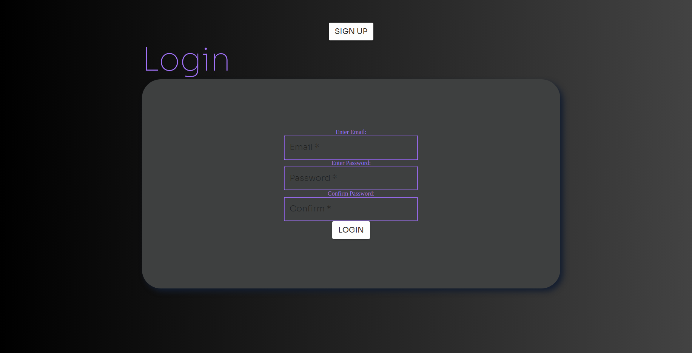
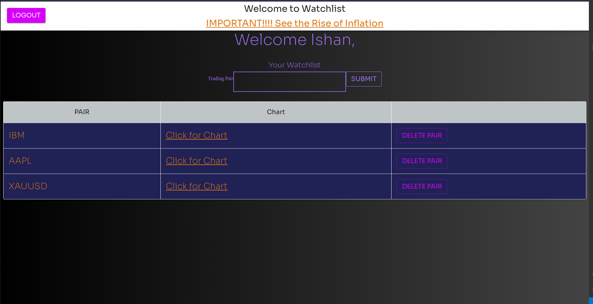
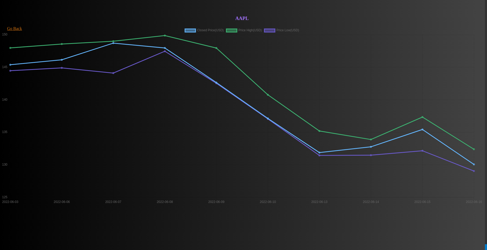

# Welcome To Traders-Watch

## This app was designed for traders or financial enthusiasts who like to keep their eyes on the market!!

## Description: 
### With this app, users can sign up and login using token based authentication. When logged in, users are able to search for their most interested entities, including currencies, stocks, crypto, commodities etc.. User's have the ability to save, and delete entities according to their interests. When searching for an entity, user's are able to view a chart to have insight of how the entity is performing. The chart provides the highest price, lowest price, and closed price for that specific day. The chart has history of the performance of the entity from the last 10 days.

## Technologies Used:
- JSX
- React
- CSS
- Material UI
- MongoDB
- Mongoose
- Express-NodeJs
- Heroku
- Alpha Vantage API
- Chart JS

## Getting Started:
### Heroku Link: https://traders-watch.herokuapp.com/
### Trello Board: https://trello.com/b/YwxjUPAZ/traders-alert
### ERD: https://lucid.app/lucidchart/fa00c543-c236-4e3d-9d6b-69d97410d5da/edit?page=0_0&invitationId=inv_5219e4d9-262e-4116-95ca-a1b5789753bf#

## Next Steps:
- AAU I want to be able to create different watchlists for different assets
- AAU I would want to know the current price
- AAU I want to be able to create alerts for when price reaches a specific target
- AAU I would want examples of different assets on display
- AAU if there was any signup or login errors, I would want to know what caused this error
- AAU I want the webpage to be responsive for smaller screens

